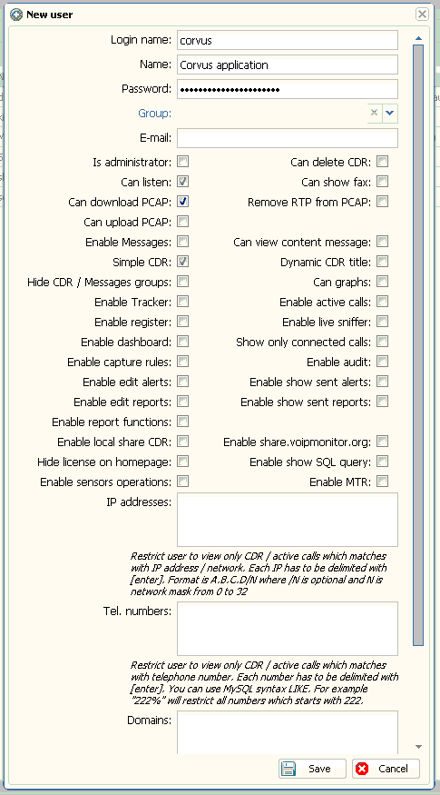

# Corvus

A prototype Rails application that ingests phone call records from a [VoIPmonitor](http://www.voipmonitor.org/) instance and provides aggregate high-level reporting on phone call activity, as well as audio playback.

## Teams

Teams within your organisation can be set up based on their phone extensions or number ranges. Corvus system users can then be assigned to those teams to have their view of individual phone records filtered to that set.

## Campaigns

Assign dedicated phone numbers to marketing campaigns to report on conversions.

## Call Ratings

Use a simple star-rating system for QA.

## Development

* Have a working installation of `rvm` ([https://rvm.io/](https://rvm.io/))
* `rvm install ruby-2.2.2-corvus` # or whatever our .ruby-version is
* `gem install bundler`
* `bundle install`
* The rest of the regular Rails 4 stuff.

## Deployment

Via Capistrano.

## Setting up new deployment targets

For a machine that's already running the VoIPmonitor web interface:

##### On the remote host

* Ensure you have passwordless SSH access to the target host.
* `sudo apt-get install git`
* Generate an SSH key (`ssh-keygen`) and add its public key as a read-only deployment key on your Git repo (if private)
* Install `rvm` as per instructions at [https://rvm.io/](https://rvm.io/)
* `rvm install ruby-2.2.2-corvus` # or whatever our .ruby-version is
* `mkdir -p ~/corvus/shared/wav`
* `rvm use ruby-2.2.2-corvus`
* `gem install bundler`

Now install passenger and its Apache module if you're using Apache.

##### MySQL grants

For example

```
create database corvus;
grant all on voipmonitor.* to corvus@localhost identified by 'corvus';
```

##### Voipmonitor API grants

We need a username, password and the following rights granted:



##### From your machine

* `scp config/*.yml <host>:corvus/shared/config/`
* `cap production deploy:check --trace`
* `cap production deploy`